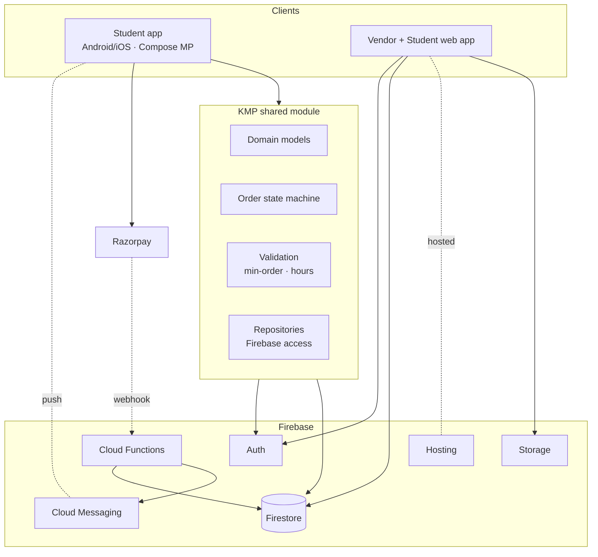
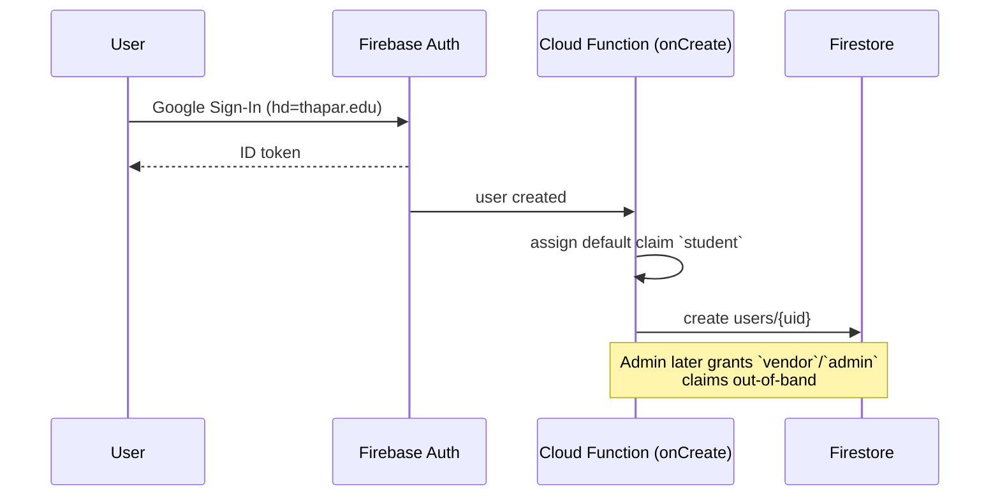
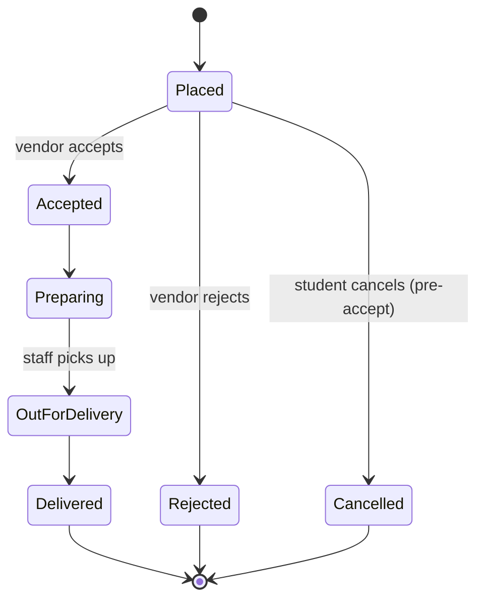
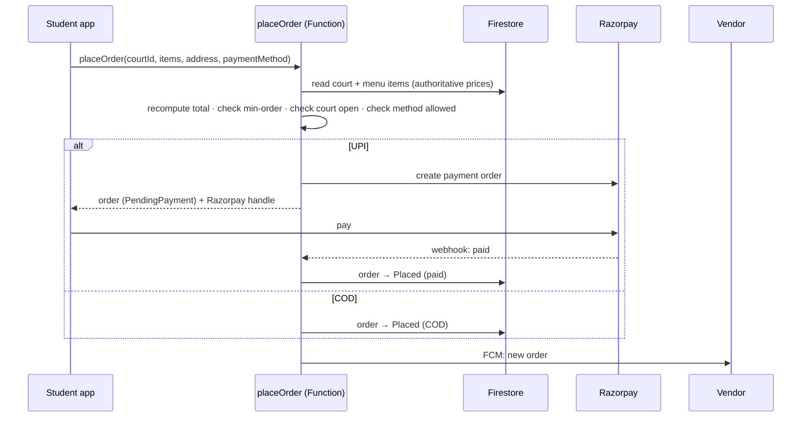

# Architecture — Thapar Bites

> Companion to [PRD.md](PRD.md). This document describes *how* the system is built; the PRD describes *what* and *why*.

---

## 1. Guiding principles

1. **Share logic, not just code.** Order rules, validation, and models live once in the KMP shared module and are reused by every client.
2. **The server is the source of truth for money and state.** Clients never compute final order totals, enforce minimums, or transition order status unilaterally — Cloud Functions and security rules do.
3. **Campus-scoped by design.** Identity (`thapar.edu`), delivery (hostels), and vendors (campus courts) are all bounded — we exploit this rather than generalize.
4. **Real-time first.** Order status is a live thing; clients subscribe to Firestore rather than poll.

---

## 2. Component overview

### 2.1 Clients

- **Student mobile app (Android + iOS)** — the primary surface. UI in Compose Multiplatform, all logic from the shared module.
- **Web app** — the **vendor dashboard** is the main web use case (vendors work on a laptop with a data-dense order queue); a student web version is a secondary benefit. Built as a lightweight web app talking to Firebase directly.

### 2.2 Shared KMP module

The heart of the codebase. Contains:
- **Domain models** — `User`, `Court`, `MenuItem`, `Order`, `Address`, enums for roles/status/payment.
- **Order state machine** — the only place order transitions are defined (see §4).
- **Validation** — minimum-order-value checks, operating-hours checks, cart integrity.
- **Repositories** — typed access to Firestore/Auth via the GitLive Firebase Kotlin SDK, exposing suspend functions and Flows.

The web app **reuses the shared *contract*** (Firestore schema, security rules, documented model shapes) rather than compiled Kotlin — see [PRD.md](PRD.md) Open Decision D2.

### 2.3 Firebase services

| Service | Role |
|---|---|
| **Auth** | Google Sign-In restricted to `thapar.edu`; provisioned email/password for vendors/admin. Roles via custom claims. |
| **Firestore** | Primary datastore; real-time listeners drive live order status. See [DATA_MODEL.md](DATA_MODEL.md). |
| **Cloud Functions** | Server-authoritative order placement, payment verification (Razorpay webhook), notification fan-out. See [FUNCTIONS.md](FUNCTIONS.md). |
| **Cloud Messaging (FCM)** | Push notifications for new orders (vendor) and status changes (student). |
| **Storage** | Menu item images. |
| **Hosting** | Serves the web app. |

---

## 3. Identity & authorization

- **Students:** any `@thapar.edu` Google account → default `student` claim.
- **Vendors / admins:** accounts provisioned by an admin; `vendor` or `admin` custom claim set via an admin-only function.
- **Authorization** is enforced in two layers: **Firestore security rules** (who can read/write which documents) and **Cloud Functions** (business operations like placing an order or granting a role).

See [DATA_MODEL.md](DATA_MODEL.md) §Security rules for the rule matrix.

---

## 4. Order lifecycle (state machine)

- Defined **once** in the shared module as the single authority on valid transitions.
- Clients request a transition; a Cloud Function validates it against the machine and the caller's role before writing. This prevents illegal jumps (e.g. a student marking their own order `Delivered`).

---

## 5. Placing an order (critical path)

**Why server-side:** prices, minimum-order value, court hours, and allowed payment methods are all validated on the server against the authoritative court/menu documents. The client's cart is a *request*, never the final word.

---

## 6. Real-time & notifications

- **Live status:** both student and vendor subscribe to the relevant `orders` documents via Firestore listeners (exposed as Flows from the shared repositories). Transitions appear in ~seconds.
- **Push:** a Firestore trigger (`onOrderStatusChange`) fans out FCM messages — to the vendor on a new order, to the student on each subsequent transition. FCM tokens are stored per user in `users/{uid}`.

---

## 7. Offline behavior

- **Browsing** (courts, menus) works from Firestore's local cache when offline.
- **Ordering** requires connectivity — payment and server validation cannot happen offline; the UI surfaces this clearly rather than queuing silently.

---

## 8. Cross-cutting concerns

| Concern | Approach |
|---|---|
| Config (Razorpay keys, etc.) | Firebase environment config / secrets; never in client code. |
| Money correctness | Server recomputation + Razorpay webhook reconciliation; totals stored as integer minor units (paise). |
| Error handling | Repositories return typed results; UI shows actionable messages (e.g. "Below ₹X minimum for this court"). |
| Observability | Cloud Functions logs; Firebase Crashlytics for mobile. |
| Time & hours | Operating hours evaluated server-side in the campus timezone (Asia/Kolkata). |

---

## 9. Key architectural decisions

See the **Decision Log** in [PRD.md](PRD.md) §8 for the full list. The architecturally load-bearing ones:

- KMP shared module + Compose Multiplatform mobile; separate web app.
- Firebase as the entire backend (no custom servers in v1).
- Server-authoritative orders via Cloud Functions.
- Vendor-direct payment settlement (the platform is **not** a payment aggregator in v1).
- Status-based tracking, not GPS, in v1.
