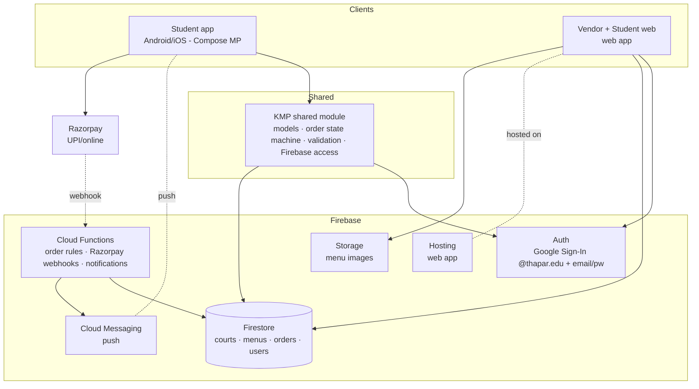
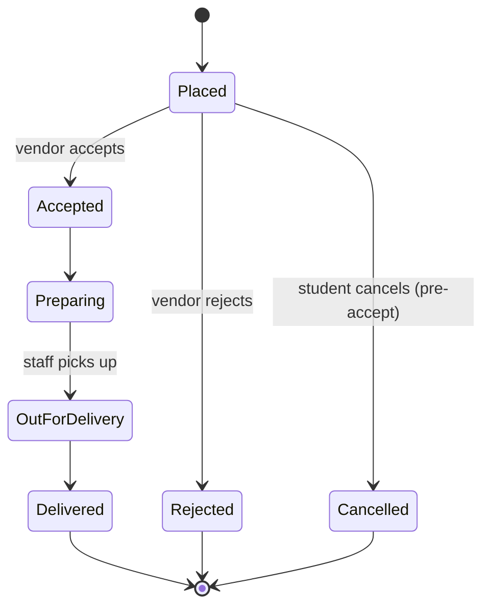

# Thapar Bites — Product Requirements Document

> **Status:** Draft v1 · **Last updated:** 2026-09-13
> Food delivery from campus food courts to hostels at Thapar.

---

## 1. Overview & Vision

**Thapar Bites** is a multiplatform food-ordering and delivery app for the Thapar campus. Students order from any participating campus food court and have the food delivered to their hostel. Each food court manages its own menu, orders, and delivery staff through the app.

The product is deliberately **campus-scoped**: only Thapar students can order (verified by college email), delivery is only to on-campus hostels, and vendors are the campus food courts themselves. This narrow scope is the product's advantage — it lets us handle campus-specific realities (hostel/block addressing, per-court rules, no external logistics) far better than a generic delivery app.

**One-line vision:** *Order from any campus food court, get it delivered to your hostel — without leaving your room or standing in a queue.*

---

## 2. Goals & Non-Goals

### Goals (v1)
- Students can browse participating food courts, build an order, and pay.
- Vendors can manage their menu, accept orders, and move them through to delivery.
- Vendors' own staff handle delivery; the app tracks order **status** end to end.
- Payment methods are **configured per food court** (UPI via Razorpay, and/or Cash on Delivery).
- **Free delivery**, with a **per–food court minimum order value** for hostel delivery.
- Real-time order status updates and push notifications to students and vendors.
- Login restricted to Thapar students via **college email**.
- Ship as **Android + iOS apps** (students) and a **web app** (primarily the vendor dashboard; student web too).

### Non-Goals (explicitly out of v1)
- **Student-runner / gig delivery** — vendors deliver with their own staff.
- **Live GPS tracking** of the delivery person — v1 uses status-based tracking (Preparing → Out for delivery → Delivered).
- **Platform commission or delivery fees** — v1 is free delivery, no platform cut; payments settle to the vendor.
- **The platform acting as a payment aggregator** — money flows vendor-direct; the app orchestrates, it does not hold funds.
- **Ratings & reviews, promotions/coupons, wallet, scheduled/pre-orders** — candidates for later.
- **Dedicated delivery-staff logins** — v1 has the vendor update delivery status; staff sub-accounts come later.

---

## 3. Target Users & Roles

| Role | Who | What they do | How they get in |
|---|---|---|---|
| **Student** | Any Thapar student | Browse courts, order, pay, track, manage saved hostel addresses | Google Sign-In restricted to `thapar.edu` |
| **Vendor** | Food court operator | Manage menu & availability, set accepted payment methods + min order value, set operating hours, accept/reject orders, advance status | Admin-provisioned account (email/password), `vendor` claim |
| **Admin** | Platform operator (you) | Onboard vendors, view all orders, resolve disputes, manage courts | Admin-provisioned account, `admin` claim |
| *Delivery staff (later)* | Vendor's delivery person | Own login to see assigned deliveries and mark delivered | Sub-account under a vendor (post-v1) |

Roles are enforced with **Firebase custom claims**. Any `@thapar.edu` Google sign-in defaults to `student`; `vendor`/`admin` claims are granted by an admin.

---

## 4. System Architecture

### 4.1 Stack (locked)
- **Shared logic:** Kotlin Multiplatform (KMP) — domain models, order state machine, validation (min-order, operating hours), and Firebase access, written once in Kotlin.
- **Mobile UI (Android + iOS):** Compose Multiplatform (stable on iOS), consuming the shared KMP module.
- **Firebase access from KMP:** GitLive Firebase Kotlin SDK (`dev.gitlive:firebase-*`), wrapping the native Firebase SDKs on each target.
- **Web:** a separate, lightweight web app for the **vendor dashboard** (and student web), talking to Firebase directly. It reuses the **shared domain contract** — the Firestore schema, security rules, and documented models — rather than compiled Kotlin. (See Open Decision D2 for the literal-code-sharing alternative.)
- **Backend:** Firebase — Auth, Firestore, Cloud Functions, Cloud Messaging (FCM), Storage, Hosting.

### 4.2 High-level diagram

### 4.3 Data model (Firestore, high level)
- `users/{uid}` — role, name, email, saved hostel addresses, FCM tokens.
- `courts/{courtId}` — name, location, operating hours, open/closed toggle, `acceptedPaymentMethods` (`["upi","cod"]`), `minOrderValue`, owner vendor uid.
- `courts/{courtId}/menuItems/{itemId}` — name, price, category, image, availability.
- `orders/{orderId}` — student uid, courtId, line items + snapshot prices, total, delivery address, payment method + status, order status, timestamps.
- Security rules enforce: students read courts/menus and read/write only their own orders; vendors read/write only their court and its orders; admin full access. **Server-side** (Cloud Functions) is the source of truth for order totals, min-order enforcement, and status transitions.

### 4.4 Order lifecycle

Status changes push a real-time update (Firestore listener) and an FCM notification to the relevant party.

---

## 5. Feature Spec by Area

### 5.1 Student app
- **Auth:** Google Sign-In restricted to `thapar.edu` hosted domain. First login creates the `users` doc as `student`.
- **Discovery:** list of food courts with open/closed state and operating hours; per-court menu with categories, prices, availability, images.
- **Cart & checkout:** one court per order; live subtotal; **min-order-value check** for the selected court (blocks checkout below threshold with a clear message); pick a saved hostel address; choose a payment method from **that court's accepted set**.
- **Payment:** UPI/online via Razorpay, or COD, per court. Payment settles to the vendor.
- **Tracking:** live status timeline; push notifications on each transition.
- **Addresses:** manage saved hostel delivery locations (hostel/block + room/details).
- **History:** past orders, reorder.

### 5.2 Vendor dashboard (web-first, also mobile-capable)
- **Auth:** provisioned email/password with `vendor` claim.
- **Menu management:** add/edit items, categories, prices, images, toggle availability.
- **Court settings:** operating hours, open/closed toggle, `acceptedPaymentMethods`, `minOrderValue`.
- **Order queue:** incoming orders in real time; accept/reject; advance status Preparing → Out for delivery → Delivered; sound/visual alert on new order.
- **Basic sales view:** today's orders and totals.

### 5.3 Admin
- Onboard vendors and create courts; grant `vendor` claims.
- View all orders across courts; intervene/resolve disputes.
- Manage which courts are live.

---

## 6. Non-Functional Requirements
- **Real-time:** order state changes reflect on student and vendor within ~seconds (Firestore listeners).
- **Notifications:** reliable FCM push for new orders (vendor) and status changes (student).
- **Correctness:** order totals and min-order enforcement computed/validated **server-side** in Cloud Functions; clients cannot fabricate prices. Payment status reconciled via Razorpay webhook.
- **Security:** Firestore security rules per role; least-privilege; no client trusts another client's writes.
- **Offline tolerance:** menu browsing works from Firestore cache; order submission requires connectivity.
- **Scale:** designed for campus scale (order thousands of students, tens of courts) — well within Firebase's comfort zone.
- **Operating hours:** ordering blocked when a court is closed or outside hours.
- **Platform coverage:** Android, iOS, and modern web browsers.

---

## 7. Open Decisions

| # | Decision | Options | Recommendation |
|---|---|---|---|
| D1 | Payment settlement | Vendor-direct (each court's own Razorpay/UPI) vs platform aggregator | **Vendor-direct in v1** — avoids the app holding funds and the heavy compliance of being an aggregator. |
| D2 | Web code sharing | TS/JS web app on Firebase JS SDK reusing the shared *contract* vs Kotlin/JS (or Wasm) reusing compiled KMP code | **TS/JS web app + shared contract** for a robust vendor dashboard; revisit Kotlin/JS if code duplication becomes painful. |
| D3 | Delivery-staff logins | Vendor updates status vs dedicated staff sub-accounts | **Vendor updates status in v1;** add staff sub-accounts later. |
| D4 | Live tracking | Status-based vs GPS tracking of delivery person | **Status-based in v1;** GPS is a later enhancement. |
| D5 | Ratings & reviews | In v1 vs later | **Later** — keep v1 focused on the core loop. |
| D6 | `thapar.edu` identity | Confirm Thapar uses Google Workspace so Google Sign-In (`hd=thapar.edu`) works; fallback = email-link verification | **Confirm with Thapar IT;** email-link is the fallback if not Google Workspace. |

---

## 8. Decision Log (locked choices)

| Area | Decision |
|---|---|
| Delivery model | **Vendor/staff delivers** — no student-runner gig model in v1. |
| v1 scope | **Realistic v1** — full student/vendor flow, status tracking, payments — **piloted on one or two food courts first.** |
| Payments | **Per–food court** accepted methods: UPI via **Razorpay** and/or **COD**; students see only what that court accepts. |
| Delivery fee | **Free delivery**, with a **per–food court minimum order value** for hostel delivery. |
| Money flow | Payments **settle to the vendor**; platform is not an aggregator and takes no cut in v1. |
| Auth | **College email** login — Google Sign-In restricted to `thapar.edu`; roles via **Firebase custom claims**. |
| Framework | **Kotlin Multiplatform** shared logic; **Compose Multiplatform** for Android + iOS UI. |
| Backend | **Firebase** — Auth, Firestore, Cloud Functions, FCM, Storage, Hosting. |
| Firebase from KMP | **GitLive Firebase Kotlin SDK.** |
| Web | **Shared KMP logic + a separate lightweight web app** for the vendor dashboard (and student web). |
| Platforms | **Android + iOS + Web.** |

---

## 9. Next Steps
1. Run **`/draft-architecture`** to turn this PRD into the project's `CLAUDE.md` (architecture rules + conventions the team codes against).
2. Run **`/draft-ticket <first thing>`** to create the first ticket — suggested first ticket: **project scaffolding** (KMP + Compose Multiplatform + Firebase project + web app skeleton), or **auth (Google Sign-In restricted to thapar.edu)**.
3. Confirm the **open decisions** (especially D1 payment settlement and D6 Thapar Google Workspace) — these unblock the payment and auth tickets.
